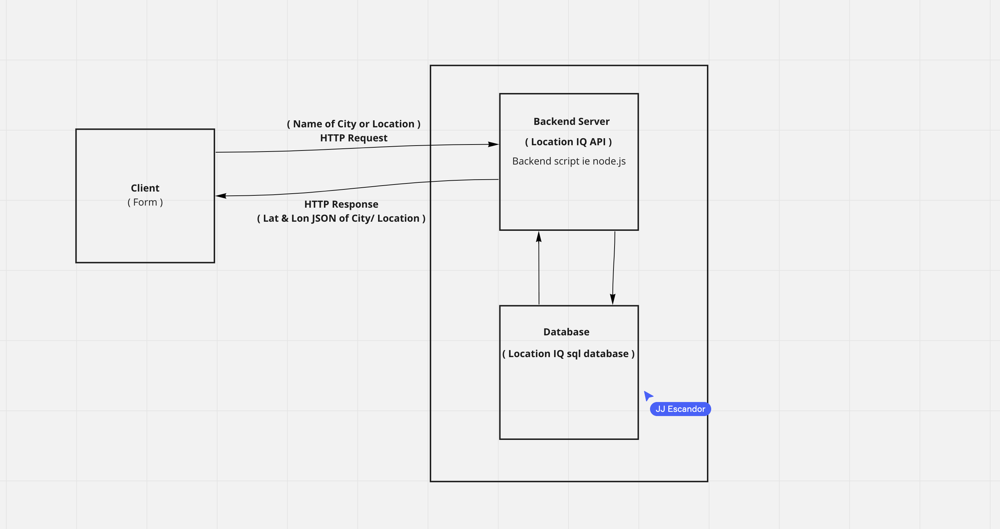

# Info Through this Lab

;

Name of feature: Adding API to city explorer

Estimate of time needed to complete: 2hr

Start time: 7:30

Finish time: 9:30

Actual time needed to complete: 2hr

**Author**: Your Name Goes Here
**Version**: 1.0.0 (increment the patch/fix version number if you make more commits past your first submission)

## Overview
This is a front end and back end application that allows users to search for locations they would like to travel to and get information

## Getting Started
The start of this application was using an API to create a map and get the Lat and Lon of a location. Now on Lab 07 I have implemented a server back-end and used a hard coded API. 
## Architecture
This application is using express.js, react.js, html, css, and javascript. Also some bootstrap componenets.

## Change Log

03-18-22: Created the back end for the server and impleeneted some of the searchQuery state updating.

## Credit and Collaborations

Worked on half of this lab 07 W classmates JJ & Erich. 03/18/22
